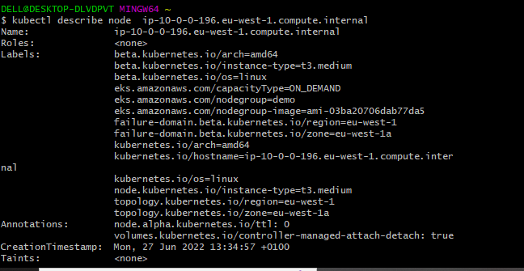

# DOCUMENTATION OF PROJECT 23

1. I updated my pod manifest file and applied it

2. I checked the pods, Exec into one of the running pods and I checked the default configuration file

   
   

 3. I checked the node that is running the pod and used the ip address to check the availability zone

      
    
    

4. I created a volume in the same availability zone

   

5. I updated the POD manifest file and applied it. Then I checked the pods

    

6. I checked the storageclass and I realized that the VolumeBindingMode is "waitforfirstconsumer" which has not been created.

    

7. So I created a file for the persistent-volume-claim and I applied it

     

 8. I checked the pvc, updated the file again and applied it

      
     
     
     
     

9. I exec into the running container and I copied the content of the index.html file

    

10. I created a config-map.yaml manifest file and a deployment manifest file, then I applied it

      
      

11. I checked the pods and exec into the running pod. Then I checked the cm too

   

12. I edited the website-index-file with my PC's editor and I restarted the deployment

   

13. I checked the pods and ran a port-forward command
    
    

14. Then I accessed the port on my browser

    

